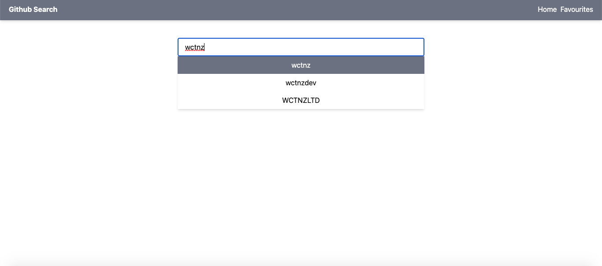
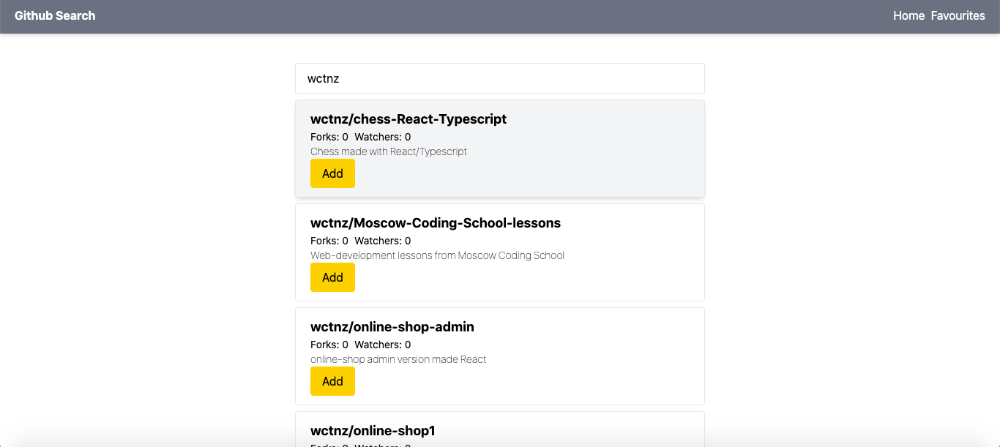
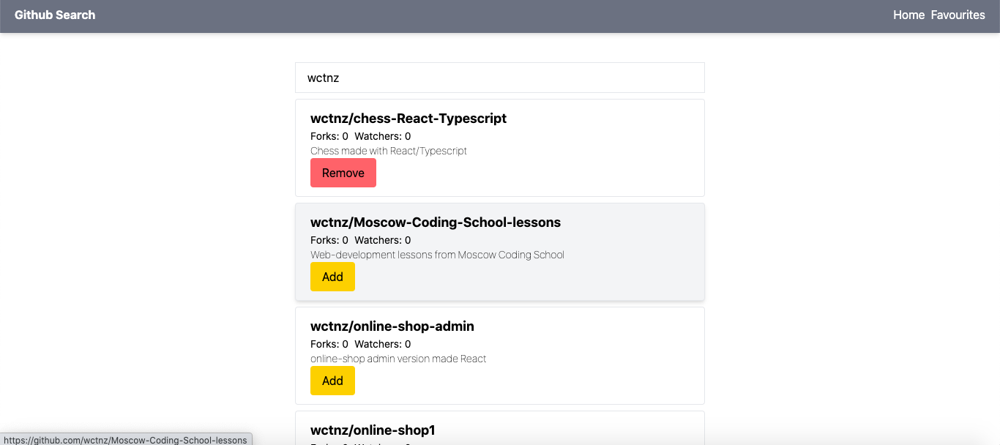
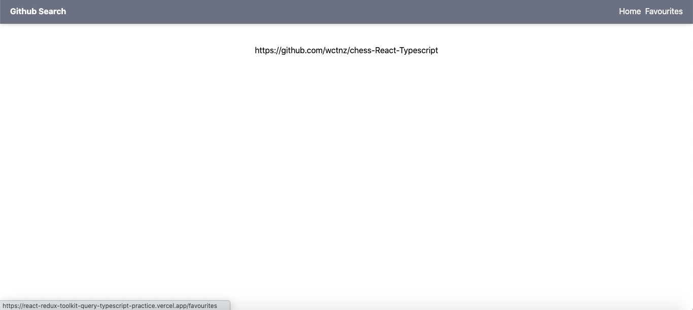

С проектом можно ознакомиться по ссылке - https://react-redux-toolkit-query-typescript-practice.vercel.app/

Приложение написано на стеке  
- React  
- Redux Toolkit  
- RTK query  
- Typescript  
- Tailwind  
  
Данные берутся из публичного API гитхаба. API настроен с помощью RTK query.  
  
C помощью Redux Toolkit в приложении создано состояние, работа с которым описана с помощью синтаксиса слайсов.   
  
Функционал приложения: в инпуте вводится имя пользователя Github. В дропдауне отображаются пользователи, соответствующие введенному имени. При клике на имя выводится список его репозиториев. Каждая карточка с репозиторием имеет кнопки Add и Remove, по клику на которые репозиторий добавляется или удаляется из "избранного". Список избранных репозиториев отображается на странице Favourites.

  
  
  

